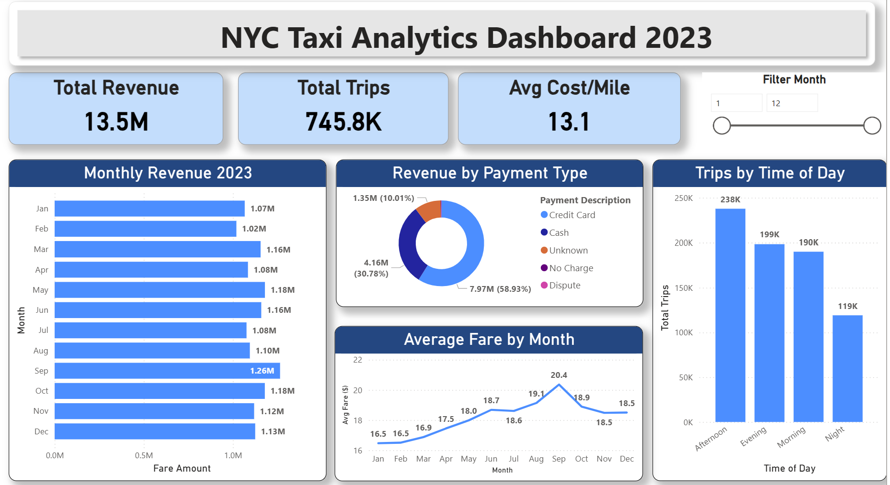
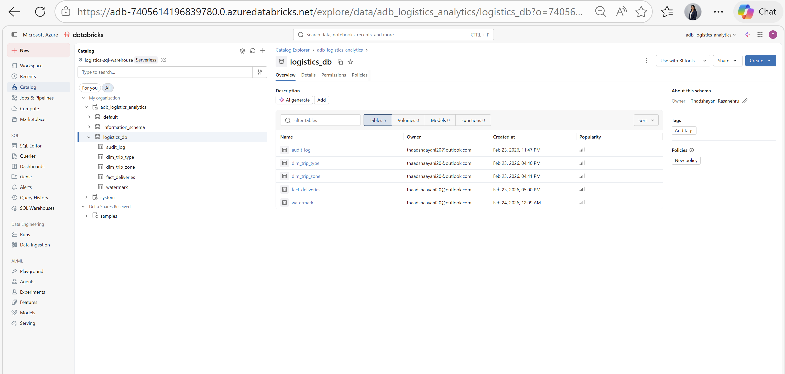
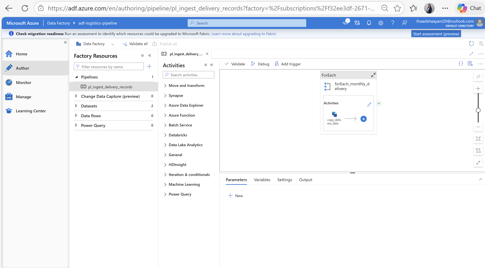
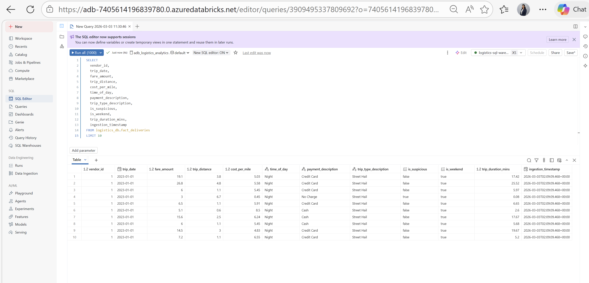
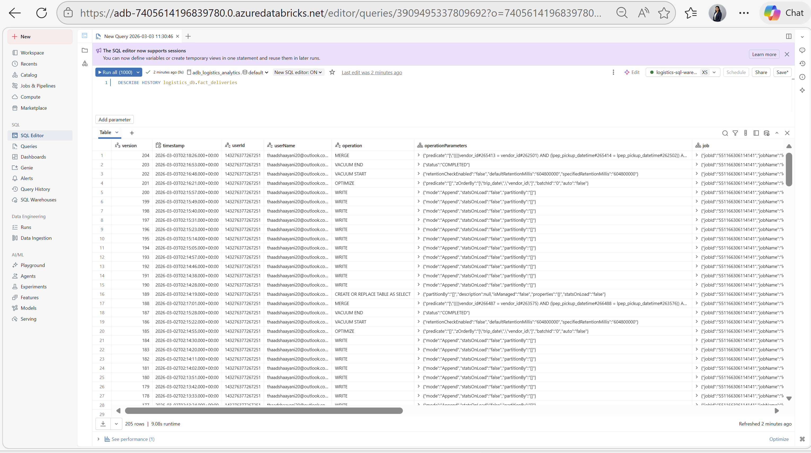
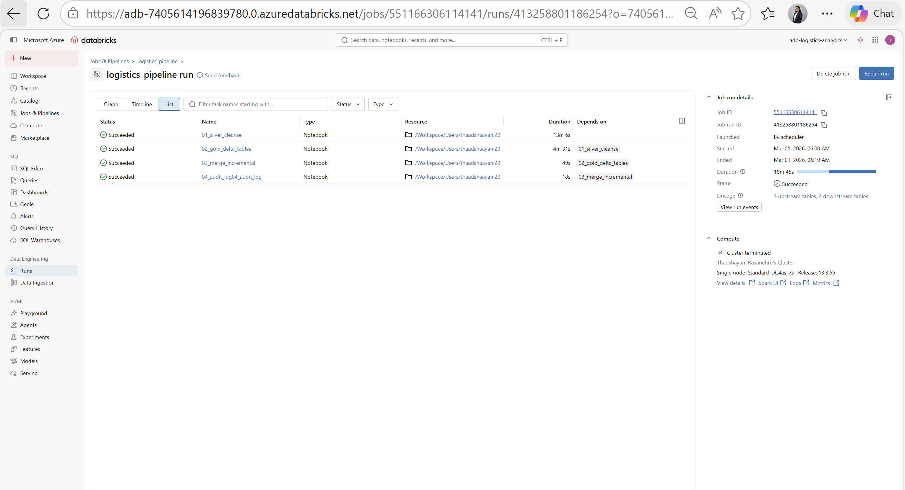
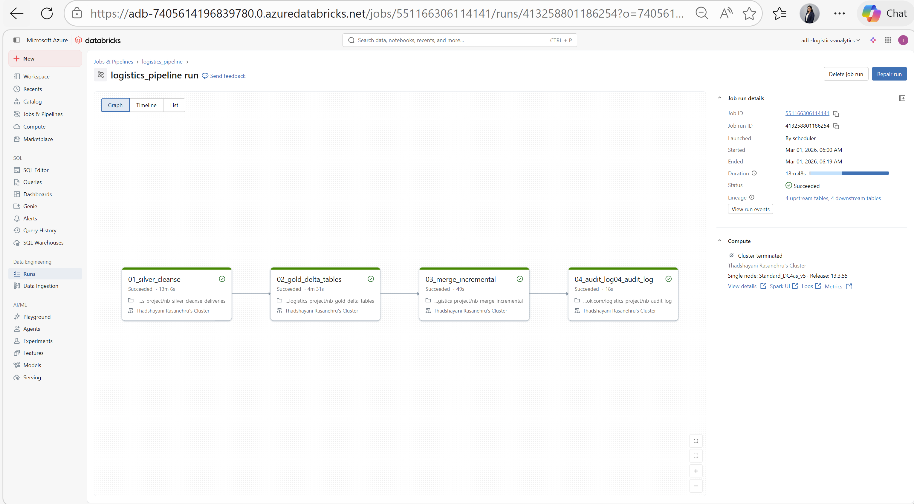
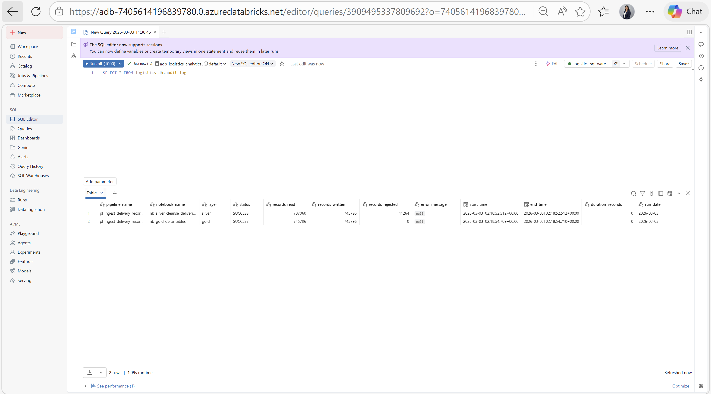

# NYC Taxi Analytics - Azure Data Engineering Pipeline


End-to-end production-grade Azure data engineering pipeline processing **745,796 NYC Green Taxi records** across 12 months of 2023 using medallion architecture (Bronze / Silver / Gold).

---

## Dashboard Preview



| Metric | Value |
|---|---|
| Total Revenue | **$13.5M** |
| Total Trips | **745,796** |
| Average Cost Per Mile | **$13.1** |
| Data Quality Rate | **94.8%** (41,264 records filtered) |
| Highest Revenue Month | **September ($1.26M)** |
| Dominant Payment | **Credit Card (58.93%)** |
| Busiest Time Period | **Afternoon (238K trips)** |

---

## Architecture

```
┌──────────────────────────────────────────────────────────────────────┐
│                          DATA SOURCES                                │
│                                                                      │
│   Source 1 — NYC TLC API            Source 2 — Raw Data (Local)     │
│   green_tripdata_2023-{01..12}      ├── taxi_zone_lookup.xlsx        │
│   12 monthly parquet files          └── trip_type.xlsx               │
│   787,060 trip records              (dimension reference files)      │
└──────────────────┬──────────────────────────┬────────────────────────┘
                   │                          │
                   ▼                          ▼
        ┌──────────────────┐     ┌────────────────────────┐
        │  Azure Data      │     │  Manually uploaded to  │
        │  Factory (ADF)   │     │  ADLS Gen2             │
        │  ForEach × 12    │     │  raw-data container    │
        └────────┬─────────┘     └───────────┬────────────┘
                 │                           │
                 ▼                           │
        ┌─────────────────┐                  │
        │  BRONZE LAYER   │                  │
        │  ADLS Gen2      │                  │
        │  787,060 records│                  │
        │  Raw parquet    │                  │
        │  Source of truth│                  │
        └────────┬────────┘                  │
                 │                           │
                 ▼                           ▼
        ┌────────────────────────────────────────────┐
        │              SILVER LAYER                  │
        │  Databricks PySpark — 13 Transformations   │
        │  ADLS Gen2 — Partitioned parquet           │
        │  745,796 clean records · 48 parquet files  │
        └───────────────────┬────────────────────────┘
                            │
                            ▼
        ┌────────────────────────────────────────────┐
        │               GOLD LAYER                   │
        │  Delta Lake — Star Schema                  │
        │  Unity Catalog — logistics_db              │
        │                                            │
        │  fact_deliveries (745,796) ◄── Silver      │
        │  dim_trip_type   (2 rows)  ◄── trip_type.xlsx
        │  dim_trip_zone   (265 rows)◄── taxi_zone_lookup.xlsx
        │  audit_log       ◄── pipeline observability│
        │  watermark       ◄── incremental tracking  │
        └───────────────────┬────────────────────────┘
                            │  DirectQuery
                            ▼
        ┌────────────────────────────────────────────┐
        │  POWER BI DASHBOARD                        │
        │  6 visualizations · Live · $13.5M revenue  │
        └────────────────────────────────────────────┘
```

---

## Unity Catalog — logistics_db



All 5 tables registered in Unity Catalog under `adb_logistics_analytics → logistics_db`:

| Table | Rows | Source | Purpose |
|---|---|---|---|
| `fact_deliveries` | 745,796 | Silver parquet | Main fact table — all trip metrics |
| `dim_trip_type` | 2 | trip_type.xlsx | Maps 1=Street Hail, 2=Dispatch |
| `dim_trip_zone` | 265 | taxi_zone_lookup.xlsx | Maps LocationID → Borough/Zone |
| `audit_log` | per run | Pipeline | Tracks every execution |
| `watermark` | 1 | Pipeline | Tracks last processed file |

---

## Data Sources

This project uses **two types of source data**:

### Source 1 — NYC TLC Trip Transaction Files
Monthly parquet files from the [NYC Taxi & Limousine Commission](https://www.nyc.gov/site/tlc/about/tlc-trip-record-data.page) — ingested automatically via ADF:
```
green_tripdata_2023-01.parquet  through  green_tripdata_2023-12.parquet
12 files · 787,060 raw trip records
```

### Source 2 — Dimension Reference Files
Two Excel files in `raw_data/` manually uploaded to ADLS Gen2 raw-data container:

| File | Rows | Purpose | Gold Table |
|---|---|---|---|
| `taxi_zone_lookup.xlsx` | 265 | Official TLC zone reference — LocationID → Borough, Zone | `dim_trip_zone` |
| `trip_type.xlsx` | 2 | Trip type codes — 1=Street Hail, 2=Dispatch | `dim_trip_type` |

> Without these two files, LocationID and trip_type appear as raw integers in Power BI with no geographic or business meaning.

---

## Technology Stack

| Component | Technology |
|---|---|
| Cloud Platform | Microsoft Azure |
| Ingestion | Azure Data Factory (ADF) — Dynamic ForEach pipeline |
| Storage | Azure Data Lake Storage Gen2 (Bronze / Silver / Gold) |
| Processing | Azure Databricks (DBR 13.3 LTS) |
| Language | PySpark / Python |
| Table Format | Delta Lake (ACID + Time Travel + MERGE) |
| Governance | Unity Catalog + External Locations |
| Orchestration | Databricks Workflows (4-task, scheduled daily) |
| Visualization | Power BI Desktop (DirectQuery — live connection) |
| Security | Service Principal + OAuth2 + Managed Identity |

---

## Project Structure

```
nyc-taxi-azure-data-engineering/
├── README.md
├── notebooks/
│   ├── nb_silver_cleanse_deliveries.ipynb   # 13 PySpark transformations
│   ├── nb_gold_delta_tables.ipynb           # Delta table creation + dim loading
│   ├── nb_audit_log.ipynb                   # Pipeline observability
│   ├── nb_incremental_watermark.ipynb       # Watermark-based incremental load
│   └── nb_merge_incremental.ipynb           # Delta MERGE operations
├── adf_pipeline/
│   ├── pipeline/
│   │   └── pl_ingest_delivery_records.json  # ADF pipeline definition
│   ├── dataset/
│   │   ├── ds_adls_delivery_raw_sink.json   # ADLS sink dataset
│   │   └── ds_http_delivery_src.json        # HTTP source dataset
│   └── linkedService/
│       ├── ls_adls_logistics_store.json     # ADLS linked service
│       └── ls_http_logistics_api.json       # HTTP linked service
├── databricks_workflow/
│   └── logistics_pipeline_workflow.json     # Databricks workflow definition
├── raw_data/
│   ├── taxi_zone_lookup.xlsx                # TLC official zone reference (265 zones)
│   └── trip_type.xlsx                       # Trip type code reference (2 rows)
├── powerbi/
│   └── nyc_taxi_analytics_dashboard.pbix    # Power BI dashboard file
├── docs/
│   └── nyc_taxi_project_documentation.docx
└── screenshots/
    ├── dashboard_full.png                   # Power BI dashboard
    ├── adf_pipeline.png                     # ADF ForEach pipeline canvas
    ├── databricks_workflow_list.png         # Workflow run history list
    ├── databricks_workflow_graph.png        # Workflow task dependency graph
    ├── databricks_workflow_run.png          # Single run detail view
    ├── databricks_workflow_timeline.png     # Workflow timeline view
    ├── delta_history.png                    # 42 Delta versions
    ├── audit_log.png                        # Audit log table data
    ├── unity_catalog.png                    # Unity Catalog 5 tables
    └── silver_data.png                      # Transformed Silver data sample
```

---

## What Was Built

### 1. Bronze Layer — ADF Dynamic Pipeline



- Parameterized ForEach loop iterating over 12 monthly parquet files
- Dynamic file path construction — zero code changes needed for new months
- Raw data written to ADLS Gen2 bronze container completely untouched
- 787,060 records ingested across green_tripdata_2023-01 through 12
- Bronze serves as the immutable source of truth for reprocessing

---

### 2. Silver Layer — PySpark Transformations



13 transformation steps applied to 787,060 Bronze records → 745,796 clean records:

| Step | Transformation | Detail |
|---|---|---|
| 1 | Schema Drift Resolution | Per-file selectExpr cast — resolves VendorID LONG vs DOUBLE conflict |
| 2 | Smart Deduplication | dropDuplicates on 6-column business key — removed 35 duplicates |
| 3 | Column Rename | Standardise all columns to lowercase snake_case |
| 4 | Invalid Record Filter | Remove zero fare, zero distance, null vendor records |
| 5 | Date Extraction | Derive trip_date, trip_year, trip_month from pickup timestamp |
| 6 | Year Filter | Keep 2023 only — removes meter clock reset anomalies (2009/2022) |
| 7 | Trip Duration | (dropoff - pickup) / 60 seconds → trip_duration_mins |
| 8 | Suspicious Flag | Flag duration<1min, duration>300min, fare>$500, distance>100mi |
| 9 | Payment Description | Map 1-5 codes → Credit Card / Cash / No Charge / Dispute / Unknown |
| 10 | Trip Type Description | Map 1=Street Hail, 2=Dispatch |
| 11 | Cost Per Mile | fare_amount / trip_distance |
| 12 | Time of Day | Hour → Morning(6-11) / Afternoon(12-17) / Evening(18-21) / Night |
| 13 | Audit Columns | Add ingestion_timestamp, source_system, pipeline_name |

Output: 48 parquet files partitioned by `trip_year / trip_month`

---

### 3. Gold Layer — Delta Lake Star Schema

Three Delta tables built from two source types:

```
fact_deliveries  (745,796 rows)  ← Silver transformed parquet
      │
      ├── dim_trip_type  (2 rows)    ← trip_type.xlsx
      └── dim_trip_zone  (265 rows)  ← taxi_zone_lookup.xlsx
```

Delta Lake features implemented:

| Feature | Detail |
|---|---|
| OPTIMIZE | Compacts 48 small Silver files into fewer large Gold files |
| ZORDER | Sorts by trip_date + vendor_id — enables file-level pruning in Power BI |
| VACUUM | Removes files older than 168 hours — controls storage cost |
| Time Travel | 42 versions tracked — any historical version queryable |
| MERGE | INSERT new + UPDATE changed records — no full overwrite |
| ACID | Atomic transactions — no partial writes or data corruption |



---

### 4. Databricks Workflow — Automated Pipeline





4-task automated pipeline scheduled daily at **06:00 AM (UTC+04:00 — Asia/Dubai)**:

```
01_silver_cleanse     → ~18 min  (13 PySpark transforms)
        ↓ (only if succeeded)
02_gold_delta_tables  →  ~4 min  (Delta writes + dim loading)
        ↓ (only if succeeded)
03_merge_incremental  → ~40 sec  (Delta MERGE on fact table)
        ↓ (only if succeeded)
04_audit_log          →  ~9 sec  (write audit record)
```

Confirmed production run history — **all succeeded**:

| Date | Duration | Type | Status |
|---|---|---|---|
| Mar 03, 2026 | 18m 40s | Scheduled | ✅ Succeeded |
| Mar 02, 2026 | 17m 17s | Scheduled | ✅ Succeeded |
| Mar 01, 2026 | 18m 48s | Scheduled | ✅ Succeeded |
| Feb 28, 2026 | 18m 16s | Scheduled | ✅ Succeeded |
| Feb 27, 2026 | 18m 37s | Scheduled | ✅ Succeeded |
| Feb 26, 2026 | 16m 42s | Scheduled | ✅ Succeeded |
| Feb 25, 2026 | 18m 18s | Scheduled | ✅ Succeeded |
| Feb 24, 2026 | 34m 41s | Manual | ✅ Succeeded |

> Each task runs **only if the previous task succeeded** — bad Silver data never reaches Gold.

---

### 5. Production Features

**Watermark-Based Incremental Loading**
```
Run 1 (first time) : No watermark → full load 12 files → 787,060 records
                     Watermark set to: green_tripdata_2023-12.parquet

Run 2 (next day)   : Watermark found → 0 new files → pipeline exits cleanly
                     No compute wasted

Run 3 (new file)   : green_tripdata_2024-01 detected → only 1 file processed
                     ~18 minutes instead of full run → significant compute saving
```

**Audit Log Table**



```
Tracks every pipeline execution:
pipeline_name · notebook_name · layer · status (SUCCESS/FAILED)
records_read · records_written · records_rejected · duration_seconds
error_message (first 200 chars for FAILED runs)
```

**Error Handling**
```python
try:
    df = spark.read.parquet(file_path)
    count = df.count()
    return count, None                         # SUCCESS path
except Exception as e:
    error_msg = str(e)[:200]
    write_audit_log(..., 'FAILED', error_msg)  # log it
    continue                                   # skip bad file, keep going
```

> One bad file never crashes the whole pipeline.

---

## Key Technical Challenges Solved

### Challenge 1 — Photon Engine Schema Conflict
**Problem:** VendorID stored as `LONG` in January but `DOUBLE` in subsequent months. Photon's vectorized engine raised `ClassCastException: MutableDouble cannot be cast to MutableLong` on month 8 every run.

**Root Cause:** Reading all 12 files together caused cross-file schema comparison inside Photon.

**Solution:**
```python
dfs = []
for month in range(1, 13):
    df = spark.read.format('parquet').load(path)
    df = df.selectExpr(
        'CAST(VendorID AS DOUBLE) AS VendorID',
        'CAST(fare_amount AS DOUBLE) AS fare_amount',
        # all 20 columns cast explicitly per file
    )
    dfs.append(df)

df_all = reduce(lambda a, b: a.unionByName(b), dfs)
df_all.cache().count()  # force full materialisation before any transform
```
Each file is typed individually before union — Photon never sees a cross-file type difference.

---

### Challenge 2 — Unity Catalog Blocking All ADLS Writes
**Problem:** Workspace upgraded to Unity Catalog. All Silver and Gold writes failed: `NO_PARENT_EXTERNAL_LOCATION_FOR_PATH`. DBFS root also disabled.

**Solution:** Located existing `unity-catalog-access-connector` managed identity in Azure portal → created `sp_logistics_credential` → registered `gold_external_location` and `silver_external_location` with Read, Write, Delete, List permissions validated.

---

### Challenge 3 — Silver Write Loop Stopping at Month 1
**Problem:** Month-by-month write loop produced data only for month 1. Months 2-12 were empty folders (0 bytes).

**Root Cause:** Spark lazy evaluation — each write iteration triggered a fresh Bronze re-read, causing the Photon schema conflict to re-occur from month 2 onward.

**Solution:**
```python
df_silver.cache()
df_silver.count()  # force ALL records into cluster memory ONCE
# write loop now reads from cache — Bronze never touched again
for month in months:
    df_month = df_silver.filter(col('trip_month') == month)
    df_month.write.parquet(silver_path)
```

---

## Data Pipeline Metrics

| Metric | Value | Detail |
|---|---|---|
| Raw Records (Bronze) | 787,060 | 12 monthly TLC parquet files |
| Clean Records (Silver) | 745,796 | 94.8% quality retention |
| Rejected Records | 41,264 (5.2%) | Zero fare / distance / null vendor / wrong year |
| Silver Parquet Files | 48 | Partitioned by trip_year / trip_month |
| Gold Delta Tables | 3 | fact_deliveries + dim_trip_zone + dim_trip_type |
| Production Tables | 2 | audit_log + watermark |
| Delta Versions | 42 | Full transaction history |
| Total Revenue Analyzed | $13.5M | Sum of fare_amount |
| Avg Pipeline Duration | ~18 min | Confirmed across 8 scheduled runs |
| Workflow Schedule | 06:00 AM | UTC+04:00 Asia/Dubai |

---

## Business Insights

From the Power BI dashboard:

```
Revenue by Month
  Highest : September  $1.26M   (tourist season + return-to-office)
  Lowest  : February   $1.02M   (winter suppresses discretionary travel)

Average Fare Trend
  January  $16.5  →  September  $20.4  →  December  $18.5
  +24% increase Jan→Sep — longer tourist trips + congestion surcharge

Payment Split
  Credit Card  58.93%  $7.97M   (auto-reconciled, full audit trail)
  Cash         30.78%  $4.16M   (manual reconciliation, tip not captured)
  Unknown      10.01%  $1.35M   (connectivity failures during payment)

Trip Volume by Time of Day
  Afternoon  238K  (lunch + school + early commute)
  Evening    199K  (commute return + dining)
  Morning    190K  (outbound commute)
  Night      119K  (lowest volume, highest avg fare)
```

---

## Power BI Dashboard — Live DirectQuery

The dashboard connects live to Databricks Gold layer via DirectQuery — no data import, always current:

- **KPI Cards** — Total Revenue ($13.5M) · Total Trips (745.8K) · Avg Cost/Mile ($13.1)
- **Monthly Revenue bar chart** — Jan through Dec with September as peak
- **Revenue by Payment Type donut** — Credit Card 58.93% · Cash 30.78% · Unknown 10.01%
- **Trips by Time of Day column chart** — Afternoon to Night with actual trip counts
- **Average Fare trend line** — Jan $16.5 rising to Sep $20.4 then Dec $18.5
- **Interactive month filter slider** — filters all visuals simultaneously (range 1–12)

---

## Production Improvement Roadmap

```
Security (highest priority)
├── Azure Key Vault for service principal credentials
└── Databricks secret scope — dbutils.secrets.get()

Architecture
├── Multi-node auto-scaling cluster (current: single node Standard_DC4as_v5)
├── Gold table partitioning by trip_year/month (needed at 10M+ records)
└── Unity Catalog data lineage enabled

Data Quality
├── Rejection rate threshold alert (>10% = fail pipeline)
├── Cross-layer reconciliation checks (Bronze vs Silver vs Gold counts)
└── Dim file version history tracked in Delta

Operations
├── Email/Teams alert on pipeline failure
├── Automatic retry (2 retries, 5-min delay) on transient failures
└── Git-integrated CI/CD for notebook deployment
```

---

## Getting Started

### Prerequisites
- Microsoft Azure subscription
- Azure Databricks workspace (Unity Catalog enabled)
- Azure Data Lake Storage Gen2
- Azure Data Factory
- Power BI Desktop

### Setup Steps

**Step 1 — Clone repository**
```bash
git clone https://github.com/Thaadshaayani-R/nyc-taxi-azure-data-engineering.git
```

**Step 2 — Create Azure resources**
```
Resource Group  : rg-logistics-analytics-prod
ADLS containers : bronze · silver · gold · raw-data
Databricks      : workspace with Unity Catalog enabled
Data Factory    : linked to ADLS via service principal
```

**Step 3 — Upload dimension reference files to ADLS**
```
raw_data/taxi_zone_lookup.xlsx  →  ADLS raw-data container
raw_data/trip_type.xlsx         →  ADLS raw-data container
(read by nb_gold_delta_tables.ipynb to create dim_trip_zone and dim_trip_type)
```

**Step 4 — Configure service principal credentials in notebooks**
```python
# Replace in all 5 notebooks
client_id     = 'your-service-principal-client-id'
tenant_id     = 'your-tenant-id'
client_secret = 'your-client-secret'
```

**Step 5 — Register Unity Catalog external locations**
```
Create   : sp_logistics_credential (managed identity access connector)
Register : gold_external_location   → adlslogisticsstore/gold/
Register : silver_external_location → adlslogisticsstore/silver/
Permissions: Read · Write · Delete · List
```

**Step 6 — Import notebooks to Databricks workspace**
```
Upload all 5 .ipynb notebooks from notebooks/ folder to Databricks workspace
```

**Step 7 — Import ADF pipeline**
```
Data Factory → Author → ARM Template → Import
Upload files from adf_pipeline/ folder (pipeline + dataset + linkedService)
```

**Step 8 — Run pipeline in order**
```
ADF Pipeline (Bronze ingestion)     →
nb_silver_cleanse_deliveries        →
nb_gold_delta_tables                →
nb_merge_incremental                →
nb_audit_log
```

**Step 9 — Connect Power BI**
```
Open   : powerbi/nyc_taxi_analytics_dashboard.pbix
Update : Databricks connection → your workspace hostname + HTTP path
Auth   : Personal Access Token
```

---

## Author

**Thadshayani Rasanehru**
Senior Data Engineer | Azure | Databricks | PySpark | Delta Lake | Power BI

[](https://www.linkedin.com/in/thaadshaayani-rasanehru/)
[](https://github.com/Thaadshaayani-R)

---

## License

This project is licensed under the MIT License.
